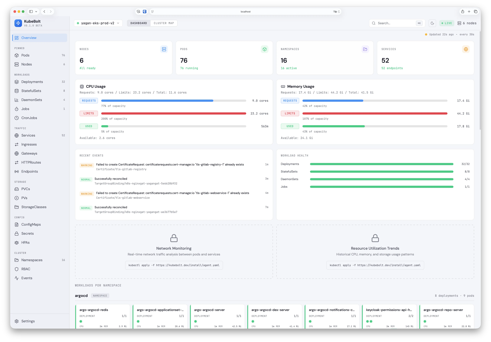
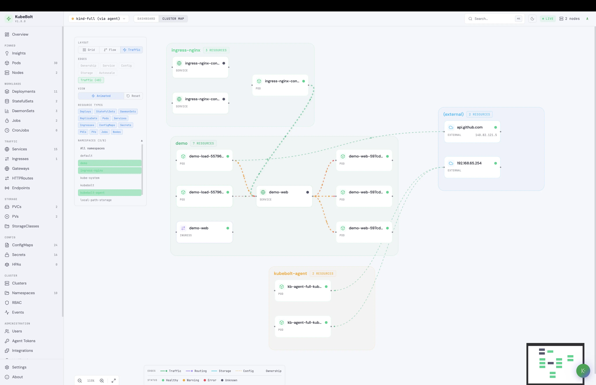
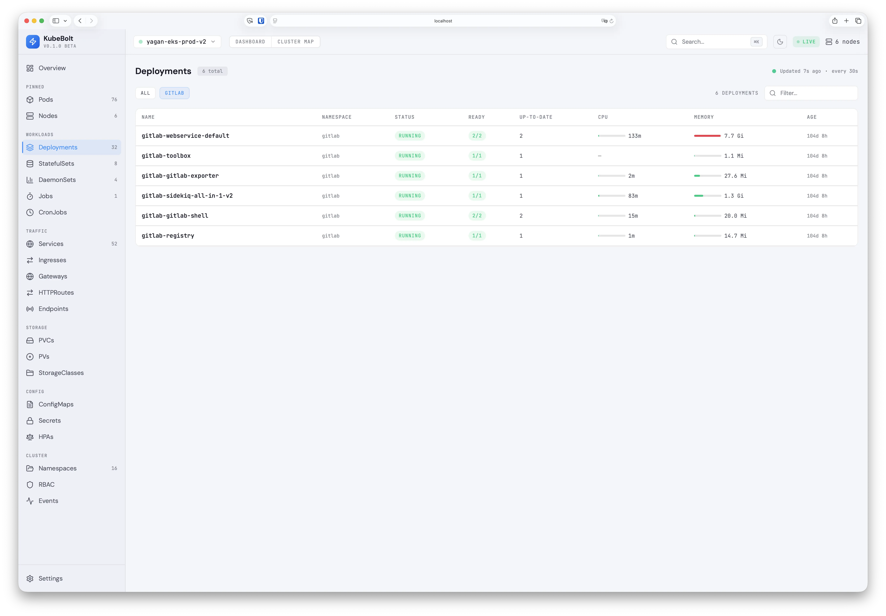

# ⚡ KubeBolt

**Instant Kubernetes Monitoring**

KubeBolt gives you full cluster visibility in under 2 minutes. No agents, no configuration, no Prometheus required.

Connect your kubeconfig → See your entire cluster → Get actionable insights.

### Dashboard Overview


### Cluster Topology Map


### Resource Views with Live Metrics


## Quick Start

### Option 1: Docker Compose (recommended)

Runs the full stack (Go API + React frontend via nginx) in containers.

**Prerequisites:** Docker Desktop with a reachable Kubernetes cluster.

#### Remote clusters (EKS, GKE, AKS, etc.)

If your kubeconfig points to remote cluster endpoints, it works directly:

```bash
# Set your kubectl context to the desired cluster
kubectl config use-context my-cluster

# Start the stack
cd deploy
docker compose up -d
```

> **EKS note:** The API container needs the AWS CLI to obtain tokens. The Dockerfile already includes `aws-cli`, and the compose file mounts `~/.aws` for credentials. Make sure your AWS profile/SSO session is active before starting.

#### Docker Desktop Kubernetes

Docker Desktop's built-in K8s uses `127.0.0.1:6443` as the API server address, which doesn't work from inside a container. A helper script rewrites the kubeconfig to use `kubernetes.docker.internal` instead:

```bash
# 1. Enable Kubernetes in Docker Desktop (Settings > Kubernetes > Enable)
# 2. Switch to the docker-desktop context
kubectl config use-context docker-desktop

# 3. Generate a container-compatible kubeconfig
./deploy/docker-kubeconfig.sh

# 4. Start the stack
cd deploy
docker compose up -d
```

Open http://localhost:3000 — the nginx frontend proxies API and WebSocket requests to the backend.

To stop: `docker compose down`

To rebuild after code changes: `docker compose up -d --build`

### Option 2: Local development (no Docker)

Requires Go 1.22+ and Node 20+.

```bash
# Start the backend
cd apps/api
go run cmd/server/main.go --kubeconfig ~/.kube/config

# Start the frontend (separate terminal)
cd apps/web
npm install && npm run dev
```

Open http://localhost:5173 — Vite proxies `/api` and `/ws` to the backend on port 8080.

## Features

- **Multi-cluster** — All kubeconfig contexts auto-discovered, switch clusters in one click
- **23 resource views** — Pods, Deployments, Services, Ingresses, Gateways, HTTPRoutes, Nodes, and more
- **Cluster Map** — Interactive topology with Grid and Flow layouts, namespace grouping, resource type filters
- **Insights Engine** — 12 built-in rules: crash loops, OOM kills, CPU throttling, HPA saturation, pending PVCs
- **Gateway API** — Native support for `gateway.networking.k8s.io` Gateways and HTTPRoutes
- **Metrics** — CPU/Memory usage from Metrics Server with graceful degradation when unavailable
- **Real-time** — WebSocket-powered live updates via K8s shared informers
- **~19 MB RAM** — Lightweight Go backend with in-memory caches, no database required

## Architecture

```
┌─────────────────────────────┐
│    Kubernetes Cluster(s)    │
│  API Server + Metrics Server│
└────────────┬────────────────┘
             │ kubeconfig (all contexts)
┌────────────▼────────────────┐
│  KubeBolt Backend (Go)      │
│  Cluster Manager            │
│  ├─ Shared Informers        │
│  ├─ Dynamic Client (GW API) │
│  ├─ Metrics Collector       │
│  └─ Insights Engine (12     │
│     rules)                  │
└────────────┬────────────────┘
             │ REST API + WebSocket
┌────────────▼────────────────┐
│  KubeBolt Frontend (React)  │
│  ├─ Dashboard Overview      │
│  ├─ Cluster Map (Grid/Flow) │
│  └─ 23 Resource Views       │
└─────────────────────────────┘
```

## Phase 1 (Current)

- Zero install — only a kubeconfig needed
- Multi-cluster support with runtime switching
- Kubernetes API Server + Metrics Server (optional, graceful degradation)
- Gateway API support (`gateway.networking.k8s.io/v1`)
- 23 resource views + interactive cluster topology map with two layout modes
- Insights engine with 12 rules and actionable recommendations
- Namespace workload cards with pod status dots and CPU/Memory bars
- Resource lists enriched with live metrics (CPU, Memory, pod counts)

## Phase 2 (Planned)

- Lightweight DaemonSet agent for network/disk metrics
- Historical time-series data (VictoriaMetrics)
- Container-level metrics granularity
- Enhanced cluster map with traffic flow animation

## Tech Stack

| Component | Technology |
|-----------|-----------|
| Backend | Go 1.22+ with client-go, Chi v5, gorilla/websocket |
| K8s Client | Shared informers (typed) + dynamic client (Gateway API CRDs) |
| Frontend | React 18 + TypeScript + Vite 5 + Tailwind CSS 3.4 |
| Cluster Map | React Flow 11 with custom nodes, edges, namespace group nodes |
| Data Fetching | TanStack Query 5 + TanStack Table 8 |
| Icons | Lucide React |

## Performance

| Metric | Value |
|--------|-------|
| Backend RAM | ~19 MB |
| Frontend bundle | 485 KB JS + 28 KB CSS (~148 KB gzipped) |
| API response time | < 5ms (from informer cache) |
| Startup time | < 3s (informer sync + initial metrics poll) |

## License

MIT License — see [LICENSE](LICENSE) for details.
