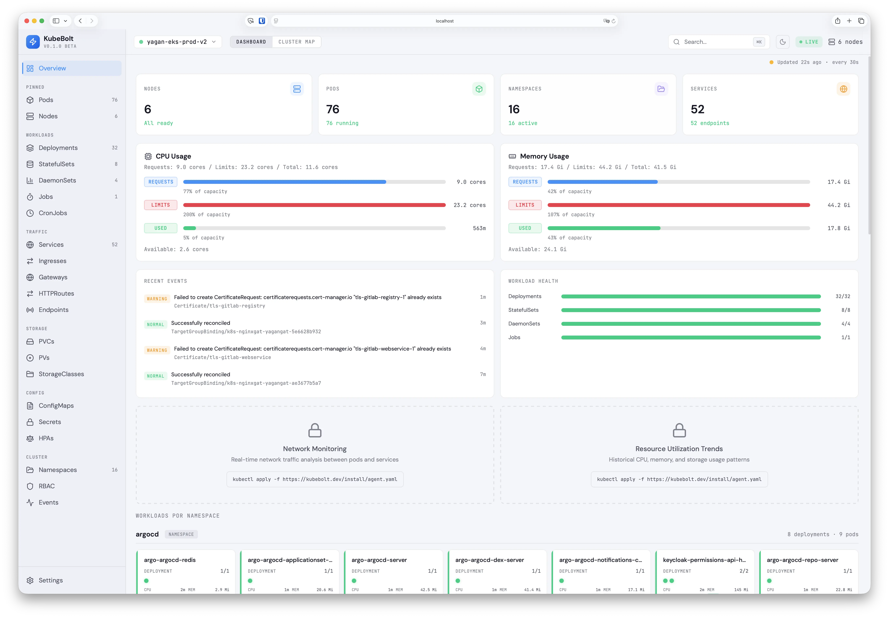

<div align="center">


# KubeBolt

**The open-source Kubernetes operations platform.**

One place to see, understand and operate your clusters — health, topology,
operations, cost and security — with Kobi, an AI SRE that reasons over the
same context and acts only when you approve.

[](LICENSE)
[](https://github.com/clm-cloud-solutions/kubebolt/releases/latest)
[](https://github.com/clm-cloud-solutions/kubebolt/actions/workflows/ci.yml)
[](https://artifacthub.io/packages/search?repo=kubebolt)
[](https://github.com/clm-cloud-solutions/kubebolt)

[Website](https://kubebolt.io/en/) · [Documentation](https://kubebolt.io/docs) · [Quick start](#quick-start) · [KubeBolt Cloud](https://kubebolt.io/docs/cloud) · [Roadmap](https://kubebolt.io/en/roadmap) · [Changelog](CHANGELOG.md)



</div>

## Why KubeBolt

A Kubernetes alert tells you *what* broke. Finding out *why* usually means
hopping between kubectl, dashboards, logs, the deploy history and a chat
thread. KubeBolt puts that context in one place and keeps it there for the
rest of the day, not just during incidents:

- **See** — every cluster at a glance, live resource state, history, the
  service graph and what changed.
- **Understand** — 24 deterministic rules turn state into named findings with
  a recommendation, each with a history you can follow. Kobi reasons over
  that already-built context instead of going to look for it.
- **Act** — scale, restart, roll back, drain, edit, exec: the operations you
  already run through kubectl, one click away, with your RBAC and an audit
  trail. Or let Kobi prepare the change, dry-run it and wait for your
  approval.

It starts with just a kubeconfig. Add the optional agent when you want
history, network flows, cost, or to reach clusters whose API server is not
reachable from where KubeBolt runs.

## What's inside

### Fleet and cluster views

- **Home** — where you land after signing in: what needs you across every
  cluster (unreachable clusters, silent agents, critical findings), fleet-wide
  pods, spend and findings, what happened *while you were away*, and your
  recent Kobi conversations.
- **Fleet** — every cluster's health, findings, nodes, pods and spend without
  connecting to any of them; grid or table, worst first. ⌘K searches across
  all of them.
- **Cluster dashboard** — four lenses on the active cluster:
  - *Overview*: KPIs, commitment, workload health, namespaces, recent events.
  - *Capacity*: CPU, memory, network and filesystem trends with deploy
    markers, top consumers and right-sizing recommendations from p95 usage.
  - *Reliability*: error rates, traffic, latency, error hot-spots and network
    drops from Hubble (appears when Cilium/Hubble data exists).
  - *Cost* (beta): spend, idle and savings from OpenCost (appears when
    OpenCost data exists).
- **26 resource views** with live CPU/memory, including Gateway API, Cilium
  network policies, cert-manager certificates, Argo CD applications and VPAs,
  plus Namespaces, Events and cluster RBAC. Detail pages carry YAML, logs,
  terminal, file browser (pods), related resources, revision history, events
  and a Monitor tab.
- **Applications** — Helm releases with status, values, notes, the resources
  they own and their revision history (read-only).
- **Cluster Map** — the topology in Grid and Flow layouts, and a Traffic
  layout drawn from observed Hubble flows (who calls whom, and what leaves
  the cluster).

### Insights with memory

- **24 built-in rules**: crash loops, OOM kills, image pull errors, failing
  probes, missing ConfigMaps/Secrets, stuck rollouts, NotReady nodes, pending
  PVCs, CPU throttling risk, memory pressure, under-requested workloads,
  maxed-out HPAs, services without endpoints, NetworkPolicy and PDB gaps,
  expiring certificates, failed Helm releases, out-of-sync Argo CD apps, and
  more. Zero configuration.
- **Episodes** — each finding has a timeline (opened, flapped, escalated,
  muted, resolved, expired) and a recurrence count, so the third time the
  same thing breaks reads as a pattern, not bad luck.
- **Mutes and rule policies** — silence one resource on one rule, with an
  expiry or until it resolves (critical always pierces). Tune thresholds and
  severities install-wide; a rule you turn off is still counted, so the
  silence is never invisible.

### Operations with guardrails

- Scale, restart, roll back to a revision, pause/resume rollouts, set image,
  resources or env, edit labels and annotations, create resources, apply
  YAML, cordon/uncordon, drain (with live progress), evict (respects
  PodDisruptionBudgets), debug containers, suspend/resume/trigger CronJobs,
  delete.
- Pod terminal, file browser, logs and port-forwarding from the browser.
- Server-side dry-run on proposed changes; every mutation and every access
  session (exec, port-forward, file read) lands in the audit trail.
- Three roles — viewer, editor, admin — enforced by the backend, on top of
  whatever the cluster credentials allow.

### Security and compliance

Vulnerabilities, configuration, RBAC and CIS compliance, plus a runtime feed —
normalized from the scanners you already run: **Trivy Operator**, **Kyverno**
(or Gatekeeper via PolicyReports), CIS `ClusterComplianceReport`, and
**Falco** events pushed with a cluster-scoped token. Findings are grouped per
workload (one image with 47 CVEs is one thing to fix) and survive the cluster
going away. KubeBolt doesn't scan; it doesn't replace your tools.

### Kobi Copilot — your AI SRE, with your own key

- Chat with your cluster (⌘J) or click **Ask Kobi** on an insight, a
  resource, an event or a dashboard panel.
- 26 tools: 17 to read (resources, YAML, describe, logs, events, topology,
  metrics history, insights, permissions, KubeBolt's own docs) and 9 that
  *propose* an action — restart, scale, roll back, debug, set image /
  resources / env, patch an HPA, delete. Nothing runs until you approve it.
- Bring your own key: Anthropic, or any OpenAI-compatible endpoint (OpenAI,
  Azure OpenAI, Grok, DeepSeek, Mistral, Groq, OpenRouter, or self-hosted
  models via Ollama, vLLM, LM Studio), with an automatic fallback provider.
  Off until you configure it.
- **MCP server** — the same 17 read tools for Claude Code, Cursor or any MCP
  client, over HTTP (`/api/v1/mcp`, authenticated with an API token) or stdio
  (`kubebolt-mcp`).

### Administration

Built-in authentication with local users and roles, API tokens for
automation, agent tokens and ingest activity, Slack / Discord / email
notifications, Kobi configuration and usage, and the insight rule matrix —
all configurable from the UI after first login, with environment variables as
boot defaults.

## Works with what you already run

Nothing on this list is required. KubeBolt detects what's installed and adds
it to the same context.

| Component | What KubeBolt does with it |
|---|---|
| **metrics-server** | Live CPU/memory on every list and detail page |
| **Prometheus** | Keep it: receive its `remote_write`, or have the agent read from it — including Amazon Managed Prometheus, Azure Monitor managed Prometheus and Google Managed Prometheus |
| **Cilium / Hubble** | Traffic map, Reliability dashboard, network drops |
| **OpenCost** | Cost dashboard, spend on Home and Fleet, right-sizing savings |
| **Trivy Operator · Kyverno · Falco** | Security & Compliance lenses and runtime feed |
| **Helm · Argo CD** | Applications view, release and sync-state insights |
| **Gateway API · cert-manager · VPA** | Native resource views and relationships |

Grafana stays where it is.

## Quick start

### Helm (recommended for Kubernetes)

```bash
helm install kubebolt oci://ghcr.io/clm-cloud-solutions/kubebolt/helm/kubebolt \
  --namespace kubebolt --create-namespace
kubectl -n kubebolt port-forward svc/kubebolt 3000:80
```

Open <http://localhost:3000> and sign in as `admin`. The generated password:

```bash
kubectl -n kubebolt get secret kubebolt-admin-password \
  -o jsonpath='{.data.password}' | base64 -d; echo
```

The chart deploys the API, the web UI and a single-node VictoriaMetrics for
history (10 GiB PVC, 30-day retention). A first-run wizard walks you through
the password, Kobi, the agent and notifications — every step can be skipped.
Chart reference: [deploy/helm/kubebolt](deploy/helm/kubebolt/README.md).

### On your laptop

```bash
# Homebrew (macOS, Linux)
brew install clm-cloud-solutions/tap/kubebolt
kubebolt --kubeconfig ~/.kube/config

# kubectl plugin (krew, custom index)
kubectl krew index add clm https://github.com/clm-cloud-solutions/krew-index.git
kubectl krew install clm/kubebolt
kubectl kubebolt

# Docker (single container, multi-arch, Cosign-signed; runs as a non-root user)
docker run -p 3000:3000 \
  -v ~/.kube/config:/kubeconfig:ro -e KUBECONFIG=/kubeconfig \
  ghcr.io/clm-cloud-solutions/kubebolt:latest
```

On Linux, the mounted kubeconfig must be readable by the container's
non-root user.

Binaries for Linux and macOS (amd64, arm64) and Windows (amd64) — plus the
`kubebolt-mcp` stdio server — are attached to every
[release](https://github.com/clm-cloud-solutions/kubebolt/releases/latest).
The single-process installs read every context in your kubeconfig and serve
API and UI on one port; they don't bundle a time-series store, so point
`KUBEBOLT_METRICS_STORAGE_URL` at a VictoriaMetrics (or run the Compose stack
below) if you want history.

### Docker Compose (full stack with history)

```bash
git clone https://github.com/clm-cloud-solutions/kubebolt.git && cd kubebolt
./deploy/docker-kubeconfig.sh   # only for Docker Desktop's built-in Kubernetes
cd deploy && docker compose up -d
```

API, web UI and VictoriaMetrics on <http://localhost:3000>. For EKS the
compose file mounts `~/.aws`; make sure your AWS session is active.

More options, platform guides (EKS, GKE, AKS, OpenShift, Docker Desktop) and
troubleshooting: <https://kubebolt.io/docs/installation>.

## Connecting clusters

KubeBolt reads every context in the kubeconfig it's given, or its own
ServiceAccount when it runs in-cluster. From the UI, **Add cluster** takes a
kubeconfig or walks you through installing the agent.

You need the **agent** when you want history, network flows and cost, or
when the cluster's API server isn't reachable from KubeBolt (private network,
on-prem behind NAT). It runs inside the cluster and **dials out** over gRPC —
no inbound ports, no VPN, no kubeconfig to hand over:

```bash
helm install kubebolt-agent oci://ghcr.io/clm-cloud-solutions/kubebolt/helm/kubebolt-agent \
  --namespace kubebolt-system --create-namespace \
  --set backendUrl=<kubebolt-host>:9090 \
  --set rbac.mode=reader
```

| `rbac.mode` | Read inventory | Operate (exec, scale, delete…) |
|---|:---:|:---:|
| `metrics` | — | — |
| `reader` (default) | ✅ | — |
| `operator` | ✅ | ✅ (requires auth) |

The agent can also read an existing Prometheus instead of scraping, and ships
an optional vmagent sidecar and OpenCost. Details:
[agent chart](deploy/helm/kubebolt-agent/README.md) ·
[agent guide](deploy/agent/README.md) ·
[deployment scenarios](docs/deployment-scenarios.md) ·
[compatibility](docs/COMPATIBILITY.md).

## Open Source and KubeBolt Cloud

KubeBolt ships in two editions built on the same engine. The open-source
edition is not a demo, and it stays Apache 2.0.

| | Open Source (this repository) | [KubeBolt Cloud](https://kubebolt.io/en/pricing) |
|---|---|---|
| Dashboards, insights, operations, security, cost, Fleet | ✅ Unlimited | ✅ |
| Kobi Copilot | ✅ Bring your own API key | ✅ AI credits included |
| Kobi Autopilot (autonomous remediation from a closed catalog) | — | ✅ Open beta |
| Sign-in | Local users and roles | Email or Google / Microsoft / GitHub, organizations and teams |
| Hosting, upgrades, backups | You | Managed (or Enterprise Self-Hosted) |
| Price | Free forever | Free tier; paid plans priced by infrastructure, not per seat |

## Security model

- Authentication on by default; the backend enforces roles on every route.
- RBAC-aware: KubeBolt probes what its credentials may do and only watches
  that; restricted resources are shown as restricted, not as errors.
- Secret values are redacted in YAML views; revealing one is an explicit,
  audited action. The live-update WebSocket carries notifications, never
  objects.
- The agent is outbound-only and its RBAC tier caps what the backend can do
  through it.
- No telemetry. Apart from the AI provider and notification channels you
  configure, the only outbound call KubeBolt makes on its own is a check for
  new releases on GitHub (`KUBEBOLT_UPDATE_CHECK_ENABLED=false` turns it off).

Found a vulnerability? See [SECURITY.md](SECURITY.md).

## Configuration

Most settings — Kobi, notifications, agent ingest — can be changed in
**Administration** at runtime and are persisted in the embedded store.
Environment variables provide boot-time values; the ones you're most likely
to set:

| Variable | Default | Purpose |
|---|---|---|
| `KUBEBOLT_AUTH_ENABLED` | `true` | `false` gives open access with no login |
| `KUBEBOLT_ADMIN_PASSWORD` | generated | Initial admin password (printed once if generated) |
| `KUBEBOLT_JWT_SECRET` | generated | Set it so sessions survive restarts |
| `KUBEBOLT_DATA_DIR` | `./data` | Embedded database location |
| `KUBEBOLT_METRICS_STORAGE_URL` | — | VictoriaMetrics / Prometheus-compatible endpoint for history |
| `KUBEBOLT_AI_API_KEY` | — | Enables Kobi Copilot |
| `KUBEBOLT_UPDATE_CHECK_ENABLED` | `true` | Release check against GitHub |

The complete, commented list is in [`.env.example`](.env.example) and
<https://kubebolt.io/docs/environment-variables>.

## Architecture

A Go backend with per-cluster informer caches, an embedded BoltDB for state
and VictoriaMetrics for history; a React frontend with live WebSocket
updates; and an optional outbound-only agent. See
[docs/architecture.md](docs/architecture.md).

| Layer | Technology |
|---|---|
| Backend | Go, client-go (shared informers + dynamic client), chi, gRPC, BoltDB |
| Frontend | React 18, TypeScript, Vite, Tailwind CSS, TanStack Query & Table, React Flow, xterm.js, CodeMirror 6 |
| Metrics | metrics-server, VictoriaMetrics, kubebolt-agent, Prometheus remote_write |

## Documentation

- **User documentation:** <https://kubebolt.io/docs>
- **In this repository:** [docs/](docs/README.md) — guides, integrations,
  architecture, compatibility and release notes.
- **Release notes:** [CHANGELOG.md](CHANGELOG.md) and
  [docs/releases](docs/releases/).

## Contributing

Issues, ideas and pull requests are welcome. Start with
[CONTRIBUTING.md](CONTRIBUTING.md) for the local setup (`make dev`), tests and
conventions. Questions and feedback: [GitHub Discussions](https://github.com/clm-cloud-solutions/kubebolt/discussions)
or <hello@kubebolt.io>.

## License

Apache License 2.0 — see [LICENSE](LICENSE) and [NOTICE](NOTICE).
Built by [CLM Cloud Solutions](https://www.clmcloudsolutions.es/en).
